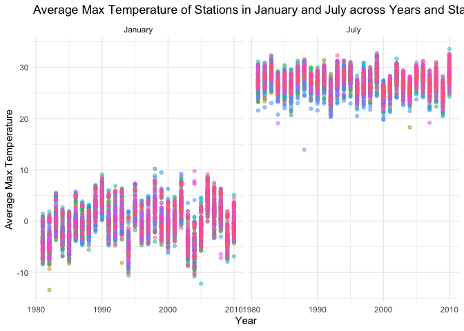

p8105_hw3_ys3924
================
YISU
2024-10-12

# Problem 1

### Read in NY NOAA data

``` r
data("ny_noaa") 
ny_noaa = ny_noaa |>
  janitor::clean_names() |> 
  separate(date, c('year', 'month', 'day'), sep ='-') |>
  mutate(prcp = as.numeric(prcp),
         tmax = as.numeric(tmax),
         tmin = as.numeric(tmin),
         year = as.numeric(year),
         prcp = prcp / 10,
         tmax = tmax / 10,
         tmin = tmin / 10)
```

Count the snow fall

``` r
snowfall_counts = ny_noaa |>
  count(snow) |>
  arrange(desc(n)) |>
  slice(1)
```

For snowfall, the most commonly observed values is 0, which contains
2008508 observations.

### Create plot showing the average max temperature in January and in July in each station across years

``` r
# Filter the data
jan_jul_temp = ny_noaa |>
  filter(month %in% c("01", "07")) |>
  group_by(id, year, month) |>
  drop_na(tmax) |>
  summarise(avg_max_temp = mean(tmax, na.rm = TRUE)) |>
  ungroup()

# Create the plot using the filtered data
  ggplot(jan_jul_temp, aes(x = year, y = avg_max_temp, color = id)) +
  geom_point(alpha = 0.5) +
  facet_wrap(~month, scales = "free_y", labeller = labeller(month = c("01" = "January", "07" = "July"))) +
  labs(title = "Average Max Temperature of Stations in January and July across Years and Stations",
       x = "Year",  
       y = "Average Max Temperature") + 
  theme_minimal() +
  theme(legend.position = "none")
```

<!-- -->

According to the above graph, average max temperature in July is higher
than in January, and temperatures appear to be more consistent during
July. The outliers exist for both January and July, where temperatures
drop significantly below the typical range for most stations.
