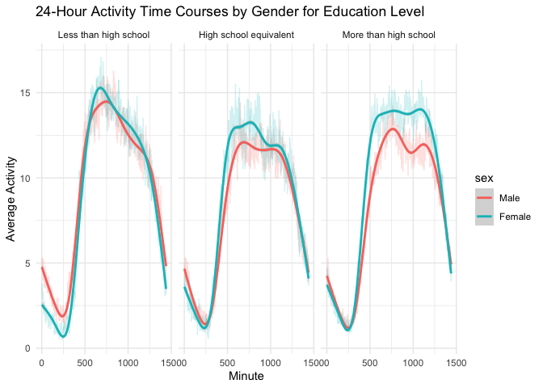
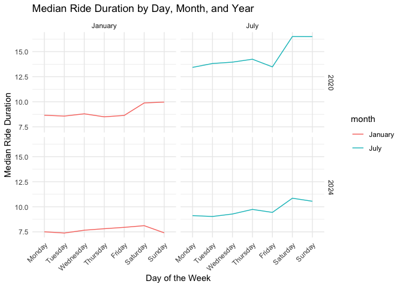

p8105_hw3_ys3924
================
YISU
2024-10-12

# Problem 1

### Read in and clean NY NOAA data

``` r
data("ny_noaa") 
ny_noaa = ny_noaa |>
  janitor::clean_names() |> 
  separate(date, c('year', 'month', 'day'), sep ='-') |>
  mutate(prcp = as.numeric(prcp),
         tmax = as.numeric(tmax),
         tmin = as.numeric(tmin),
         year = as.numeric(year),
         prcp = prcp / 10,
         tmax = tmax / 10,
         tmin = tmin / 10)
ny_noaa_row = nrow(ny_noaa)
```

The dataset contains key variables id, date, prcp, snow, tmin, tmax. The
dataset has 2595176 observations. There exists missing values for
temperature, precipitation, or snowfall, which can affect analysis if
not handled properly.

Count the snow fall

``` r
snowfall_counts = ny_noaa |>
  count(snow) |>
  arrange(desc(n)) |>
  slice(1)
snowfall_counts
```

    ## # A tibble: 1 × 2
    ##    snow       n
    ##   <int>   <int>
    ## 1     0 2008508

For snowfall, the most commonly observed values is 0, which contains
2008508 observations.

### Create plot showing the average max temperature in January and in July in each station across years

``` r
# Filter the data
jan_jul_temp = ny_noaa |>
  filter(month %in% c("01", "07")) |>
  group_by(id, year, month) |>
  drop_na(tmax) |>
  summarise(avg_max_temp = mean(tmax, na.rm = TRUE)) |>
  ungroup()

# Create the plot using the filtered data
  ggplot(jan_jul_temp, aes(x = year, y = avg_max_temp, color = id)) +
  geom_point(alpha = 0.5) +
  facet_wrap(~month, labeller = labeller(month = c("01" = "January", "07" = "July"))) +
  labs(title = "Average Max Temperature of Stations in January and July across Years and Stations",
       x = "Year",  
       y = "Average Max Temperature") + 
  theme_minimal() +
  theme(legend.position = "none")
```

<!-- -->

According to the above graph, average max temperature in July is higher
than in January, and temperatures appear to be more consistent during
July. The outliers exist for both January and July, where temperatures
drop significantly below the typical range for most stations.

### Create plot showing tmax vs tmin and distribution of snowfall values

``` r
# Plot for tmax vs tmin  for the full dataset
plot_i = ggplot(ny_noaa, aes(x = tmin, y = tmax)) +
  geom_hex() +
  labs(title = "tmax vs tmin for the full Dataset", x = "Min Temperature", y = "Max Temperature") +
  theme_minimal()
# Plot for distribution of snowfall values
plot_ii = ny_noaa |>
  filter(snow > 0 & snow < 100) |>
  group_by(year) |>
  summarise(avg_snow = mean(snow, na.rm = TRUE)) |>
  ggplot(aes(x = year, y = avg_snow)) +
  geom_col(width = 0.7) +
  labs(title = "Snowfall Distribution by Year", x = "Year", y = "Average Snowfall") +
  theme_minimal()
plot_i + plot_ii
```

<!-- -->

# Problem 2

### Read in and clean accelerometer and demographic data

``` r
accel_data = read_csv("./data/nhanes_accel.csv") |>
  janitor::clean_names() |>
  mutate(seqn = as.character(seqn))
covar_data = read_csv("./data/nhanes_covar.csv", skip = 3) |>
  janitor::row_to_names(row_number = 1) |>
  janitor::clean_names() |>
  mutate(
    sex = factor(sex, levels = c(1, 2), labels = c("Male", "Female")),
    education = factor(education, levels = c(1, 2, 3), 
                       labels = c("Less than high school",
                                  "High school equivalent",
                                  "More than high school")),
    age = as.numeric(age)
  ) |>
  drop_na() |>
  filter(age >= 21)
full_data = left_join(covar_data, accel_data, by = "seqn")
```

### Create table for the number of men and women in each education category

``` r
full_data |>
  group_by(sex, education) |>
  summarise(count = n()) |>
  pivot_wider(names_from = education, values_from = count) |>
  knitr::kable()
```

| sex    | Less than high school | High school equivalent | More than high school |
|:-------|----------------------:|-----------------------:|----------------------:|
| Male   |                    27 |                     35 |                    56 |
| Female |                    28 |                     23 |                    59 |

By looking at above table, there are slightly more women have achieved
higher levels of education (more than high school) compared to men,
while more men tend to fall in the “High school equivalent” category.
For education level less than high school, the balance between men and
women is fairly even.

### Create a visualization of the age distributions for men and women in each education category

``` r
ggplot(full_data, aes(x = education, y = age, fill = sex)) +
  geom_boxplot() +
  labs(title = "Age Distribution by Gender and Education Category", 
       x = "Education Category", 
       y = "Age") +
  theme_minimal()
```

<!-- -->

According to above boxplot, the age distribution across education levels
shows that individuals with less education, particularly “Less than high
school”, tend to be slightly older. The “High school equivalent”
category shows a younger age range for men than women. For the “More
than high school” category, the distribution are similar, except that
the median age for men is sligtly higher than women.

### Plot total activities against age

``` r
full_data = full_data |>
  mutate(total_activity = rowSums(across(starts_with("min")),na.rm = TRUE))
  
ggplot(full_data, aes(x = age, y = total_activity, colour = sex)) +
  geom_point(alpha = 0.5) +
  geom_smooth(method = "loess", se = FALSE) +
  facet_wrap(~education) +
  labs(title = "Total Activity vs. Age by Gender and Education Level",
       x = "Age",
       y = "Total Activity") +
  theme_minimal()
```

<!-- -->

From above plots, total activity of males and females decrease as age
increase across all educational level. For “less than high school”, the
total activity for women is higher before age of 40, after which men’s
total activity starts to be larger. For “high school equivalent”, the
total activity for both men and women increases, but after age of 40 it
decreases sharply. For “More than high school”, the women’s total
activity is higher than men’s for all age.

### Create plot for 24-hour activity time courses for each education level

``` r
full_data |>
  pivot_longer(cols = starts_with("min"), names_to = "minute", values_to = "activity") |>
  mutate(minute = as.numeric(str_remove(minute, "min"))) |>
  group_by(minute, sex, education) |>
  summarize(avg_activity = mean(activity)) |>
  ggplot(aes(x = minute, y = avg_activity, color = sex)) +
  geom_line(alpha = 0.2) +
  geom_smooth() +
  facet_wrap(~ education) +
  labs(title = "24-Hour Activity Time Courses by Gender for Education Level", 
       x = "Minute",
       y = "Average Activity") +
  theme_minimal()
```

    ## `summarise()` has grouped output by 'minute', 'sex'. You can override using the
    ## `.groups` argument.
    ## `geom_smooth()` using method = 'gam' and formula = 'y ~ s(x, bs = "cs")'

<!-- -->

By looking at above plot, activity peaks occur in the middle of the day
and gradually decline afterward across all education levels, which
follows the human daily routine. Women tend to have higher activity
levels than men across most of the day in all education levels,
particularly in “More than high school” group. For “Less than high
school” group, activity peaks around midday and gradually decreases. For
“High school equivalent” group, the activity pattern is more stable. For
“More than high school” group, it shows a slightly higher plateau
compared to the other groups.

# Problem 3

### Read in and clean Citi Bike data

``` r
jan_2020 = read_csv("./data/citibike/Jan 2020 Citi.csv", na = c("NA", ".", "")) |>
  janitor::clean_names() |>
  mutate(year = 2020,
         month = "January")
jan_2024 = read_csv("./data/citibike/Jan 2024 Citi.csv", na = c("NA", ".", "")) |>
  janitor::clean_names() |>
  mutate(year = 2024,
         month = "January")
july_2020 = read_csv("./data/citibike/July 2020 Citi.csv", na = c("NA", ".", "")) |>
  janitor::clean_names() |>
  mutate(year = 2020,
         month = "July")
july_2024 = read_csv("./data/citibike/July 2024 Citi.csv", na = c("NA", ".", "")) |>
  janitor::clean_names() |>
  mutate(year = 2024,
         month = "July")
citi_data = bind_rows(jan_2020, jan_2024, july_2020, july_2024)
citi_rows = nrow(citi_data)
citi_cols = ncol(citi_data)
```

The cleaned and merged dataset contains 9 variables and 99485
observations. The key variables include rideable_type, ride_id,
weekdays, duration, start_station_name, end_station_name, member_casual,
year, and month.

### Produce table showing the total number of rides

``` r
citi_data |>
  group_by(year, month, member_casual) |>
  summarise(total_rides = n()) |>
  pivot_wider(
    names_from = "member_casual",
    values_from = "total_rides") |>
  knitr::kable()
```

    ## `summarise()` has grouped output by 'year', 'month'. You can override using the
    ## `.groups` argument.

| year | month   | casual | member |
|-----:|:--------|-------:|-------:|
| 2020 | January |    984 |  11436 |
| 2020 | July    |   5637 |  15411 |
| 2024 | January |   2108 |  16753 |
| 2024 | July    |  10894 |  36262 |

Across all time periods, Citi Bike members consistently outnumber casual
riders in terms of total rides. Also, both rider types show an increase
in rides from January to July in each year. Over the span of four years,
the number of both casual and member riders grew from 2020 to 2024.

### Produce table showing the 5 most popular starting stations for July 2024

``` r
july_2024 |>
  group_by(start_station_name) |>
  summarise(total_rides = n()) |>
  arrange(desc(total_rides)) |>
  head(5) |>
  knitr::kable()
```

| start_station_name       | total_rides |
|:-------------------------|------------:|
| Pier 61 at Chelsea Piers |         163 |
| University Pl & E 14 St  |         155 |
| W 21 St & 6 Ave          |         152 |
| West St & Chambers St    |         150 |
| W 31 St & 7 Ave          |         146 |

The 5 most popular starting stations for July 2024 are Pier 61 at
Chelsea Piers, University Pl & E 14 St, W 21 St & 6 Ave, West St &
Chambers St, and W 31 St & 7 Ave.

### Create plot to investigate the effects of day of the week, month, and year on median ride duration

``` r
citi_data |> 
  mutate(weekdays = factor(weekdays, 
                      levels =c("Monday", "Tuesday", "Wednesday", "Thursday", 
                                "Friday", "Saturday", "Sunday"))) |>
  group_by(year, month, weekdays) |>
  summarise(median_duration = median(duration, na.rm = TRUE)) |>
  ggplot(aes(x = weekdays, y = median_duration)) +
  geom_col() +
  facet_grid(year ~ month) +
  labs(x = "Day of the Week", y = "Median Ride Duration", 
       title = "Median Ride Duration by Day, Month, and Year") +
  theme_minimal() +
  theme(axis.text.x = element_text(angle = 45, hjust = 1))
```

<!-- -->

According to above plots, July rides tend to have longer median
durations compared to January in both years. Saturday and Sunday have
longer median durations compared to weekdays, particularly in July. The
median ride duration in 2020 is generally longer than the median ride
duration in 2024.
